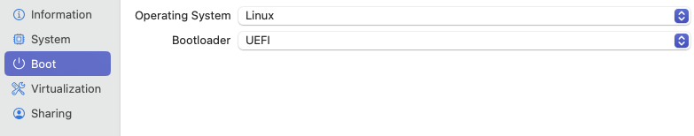
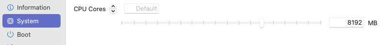
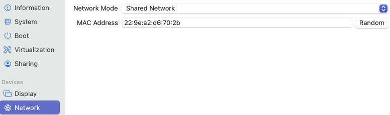
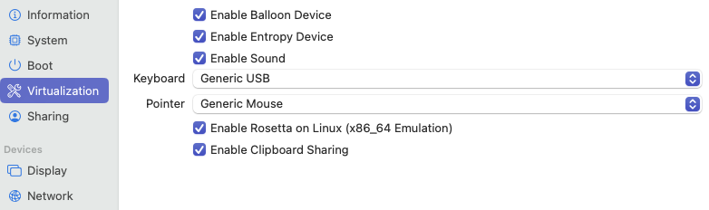

# Guide to setup up Ubuntu on UTM

Check Ubuntu site to download the latest server version of Ubuntu 24.04.01. Make sure you select the ARM64 version. There is no desktop version.

## UTM Setup

1. Create a new VM - use Apple Virtualization
2. Select the ISO you downloaded from Ubuntu site to create the VM
3. Select 8 GB RAM and 128 GB Disk Space.

>Tips: You can change the logo by selecting custom while editing the VM

Here are some images for setup in UTM.
### Boot 


### System 


### Network 


### Virtualization 



## Setting up the base version for Ubuntu Server
Update and upgrade all packages before installing anything else
``` sh
sudo apt update && sudo apt upgrade -y
```
Install `micro` and `fish`
``` sh
sudo apt install micro fish
```
Change the default shell to fish
``` sh
sudo -u $(logname) chsh -s $(which fish)
```

### Share folders between UTM host and guest
>Remember to select ***VirtFS*** in UTM settings.
1. Install the following, not sure if all is required but just install it
``` sh
sudo apt install spice-vdagent qemu-guest-agent spice-webdavd
```
2. Create a folder on guest (Ubuntu) 
    
    ``` sh
    sudo mkdir /media/share
    ```
3. For the shared folder to load after reboots, modify `/etc/fstab`. Depending on Apple or QEMU virtualization the command for temperory mounting of shared folder and permanent mounting are different. See below:

    a. <u>Apple Virtualization</u>
    ``` sh
    sudo mount -t virtiofs share /media/share
    ```
    To ensure it the folder share sticks after reboot, add the `share	/media/share	virtiofs	rw,nofail	0	0` to `/etc/fstab`. You can use the following snippet. ***It only works with bash NOT fish.***
    ``` sh
    sudo tee -a /etc/fstab > /dev/null <<EOT

    # Load shared folder
    share	/media/share	virtiofs	rw,nofail	0	0
    EOT
    ```
    >Tips: 1> The words need to be seperated by a tab. 2> Make sure you are in bash shell not **fish**

    b. <u>Using QEMU Virtualization</u>
    >Note: if using QEMU using VirtFS - make sure the folder name on MAC matches the one on guest VM
    ``` sh
    sudo mount -t 9p -o trans=virtio share /media/SharedWithVM -oversion=9p2000.L
    ```
    To ensure it the folder share sticks after reboot, add the `share	/media/SharedWithVM	9p	trans=virtio,version=9p2000.L,rw,_netdev,nofail	0	0` to `/etc/fstab`.
    >Tip: The words need to be seperated by a tab.

>NOTE: If you get error about permissions, you may need to run the following command
``` sh
sudo chown -R $USER /media/share/SharedWithVM
```
### Add alias for fish
#### Add alias for getting local IP to *fish shell*
``` sh
alias mylocalip="hostname -I"
```
#### Add alias for getting public IP to *fish shell*

``` sh
alias myip="dig +short txt ch whoami.cloudflare @1.0.0.1"
```


## Install Desktop
We will go with gnome as other desktops do not have ARM64 packages.


Install GNOME Desktop
``` sh
sudo apt install ubuntu-desktop
```
> **NOTE** You may get an error about `unmet dependencies`. For some reason packages with wrong version are shipped with the server. So we need to install previous versions. Hopefully they will fix it with next update. Till then follow the steps

### Install older versions before installing desktop
You can download them from  [https://ubuntu.pkgs.org/24.04/ubuntu-main-arm64/](https://ubuntu.pkgs.org/24.04/ubuntu-main-arm64/)

Direct download links
``` sh
wget http://ports.ubuntu.com/pool/main/s/software-properties/python3-software-properties_0.99.48_all.deb
wget http://ports.ubuntu.com/pool/main/u/ubuntu-release-upgrader/python3-distupgrade_24.04.19_all.deb
wget http://ports.ubuntu.com/pool/main/u/ubuntu-release-upgrader/ubuntu-release-upgrader-core_24.04.19_all.deb 
```
Install the downloaded files one by one

``` sh
sudo apt install /home/developer/python3-software-properties_0.99.48_all.deb -y --allow-downgrades
sudo apt install /home/developer/python3-distupgrade_24.04.19_all.deb -y --allow-downgrades
sudo apt install /home/developer/ubuntu-release-upgrader-core_24.04.19_all.deb -y --allow-downgrades
```
### Try desktop install again. This time it should work
``` sh
sudo apt install ubuntu-desktop
```
>Tip: During install, choose GDM3 during install. LightDM has some issues. 

### Resolve long boot time
There is issue with duplicate network `systemd-networkd-wait-online.service`  which takes over 2+ minutes to boot. So change default timeout from 2 min to 1 second

First disable the service
``` sh
sudo systemctl disable systemd-networkd-wait-online
```
Open the file systemd-networkd-wait-online.service in usr lib
``` sh
sudo micro /lib/systemd/system/systemd-networkd-wait-online.service
```
Search for line  `/lib/systemd/system/systemd-networkd-wait-online.service` and then *`add --timeout=1`* to its end so it looks like `/lib/systemd/system/systemd-networkd-wait-online.service --timeout=1`

Save the file and reenable the service
``` sh
sudo systemctl enable systemd-networkd-wait-online
```
##### Reboot
``` sh
sudo reboot
```


### Software Installs
Install the necessary softwares

#### Install nemo file manager. It's much better than the default one.
``` sh
sudo apt install nemo
```
#### Install & Configure Wireguard VPN
Make sure you can load the shared folder first. You can confirm by using this command
``` sh
sudo ll /media/share
```
``` sh
sudo apt install wireguard
```
Add add script to bypass sudo for our command

``` sh
sudo micro /etc/sudoers.d/mysudoer
```
Paste the following in the file and save it
```
# this file will contain my personal commands bypass sudo, this one is for wireguard
developer ALL = (root) NOPASSWD: /usr/bin/wg-quick
```
Copy required folders from Share Folder to Documents
``` sh
cp -r /media/share/SharedWithVM/Scripts ~/Documents/.
cp -r /media/share/SharedWithVM/WG-Ubuntu ~/Documents/.
```

Copy the conf files to /etc/wireguard folder
``` sh
sudo cp ~/Documents/WG-Ubuntu/*.conf /etc/wireguard/.
```
Copy the service file to `/etc/systemd/system/`

``` sh
sudo cp ~/Documents/Scripts/startVPN.service /etc/systemd/system/.
```
Make the startvpn.sh as executable
``` sh
chmod +x ~/Documents/Scripts/startvpn.sh
```
Enable the service & start the service
``` sh
sudo systemctl enable /etc/systemd/system/startVPN.service 
sudo systemctl start startVPN.service
```
Check if VPN is working
``` sh
curl ipinfo.io
```
#### Visual Studio Code
Install VS Code by following directions on the site [https://code.visualstudio.com/docs/setup/linux](https://code.visualstudio.com/docs/setup/linux)

#### Install gnome-tweaks

``` sh
sudo apt install gnome-tweaks 
```

#### Calibre, Terminator

``` sh
sudo apt install calibre
```

#### Terminator (Optional)

``` sh
sudo apt install terminator
```

#### Autokey (optional)
This is similar to Keyboard Maestro on Mac or better still AutoHotKey on Windows.
Follow instructions on https://github.com/autokey/autokey/wiki/Installing#debian-and-derivatives 

After you obtained the Debian packages, open a terminal at the directory containing the packages and use the following commands to install the packages:
``` sh
VERSION="0.96.0"    # substitute with the version you downloaded
sudo dpkg --install autokey-common_${VERSION}_all.deb autokey-gtk_${VERSION}_all.deb
sudo apt --fix-broken install
```

### Other stuff
Here are some other things to add to make it easier to use.

#### Swap WIN with CTRL
1. Open Gnome **Tweaks**
2. Select **Keyboard** in the left bar.
3. In *Layout* section, open **Additional Layout Options**.
4. Expand **Ctrl position** and select **Swap Left Win with Left Ctrl**


#### Add following extensions to VS Code
1. Code Spell Checker by Street Side Software
2. WordCounter by Etienne Faisant
3. Markdown All in One (optional) by Yu Zhang

#### Setup Git
Setup Git to download originals. 
>For password, get the fine-grained Personal Access Token from password manager
``` sh
git clone https://github.com/p400012/IAP.git
```
Add the following to git global config
``` sh
git config --global user.name "P R"
git config --global user.email ""
```

#### Setup Time Server - NTP

``` sh
sudo timedatectl set-ntp on
```


### Optional Stuff if required

#### Terminator size
1. Open Terminator, then adjust its window's size and position as desired.
2. In the Terminator window, in the command-line area, right-click then choose **Preferences**.
3. In the **Layouts** tab, expand the **Type / Name** list, select **Terminal1**, then click **Save**.
4. Exit the **Preferences** dialog, then close and re-open Terminator.

#### Terminator font spacing
1. Open Gnome **Tweaks**
2. Select **Fonts** in the left bar. 
3. In the *Preferred Fonts* section make sure *Monospace Text* is set to a Monospace font. For example `Ubuntu Sans Mono Regular`. 
>Tip: When you click to select the fonts, there is a dropdown where you can filter fonts by Monospace.

#### Add `plank` to startup apps (only if plank is installed)
1. Open Gnome **Tweaks**
2. Select **Startup Applications** in the left bar.
3. Click on the **+** sign to add any app that you want to run after login

``` sh

```
``` sh

```
``` sh

```
``` sh

```
``` sh

```
``` sh

```